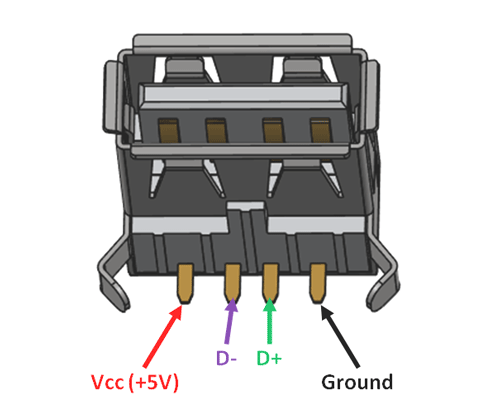
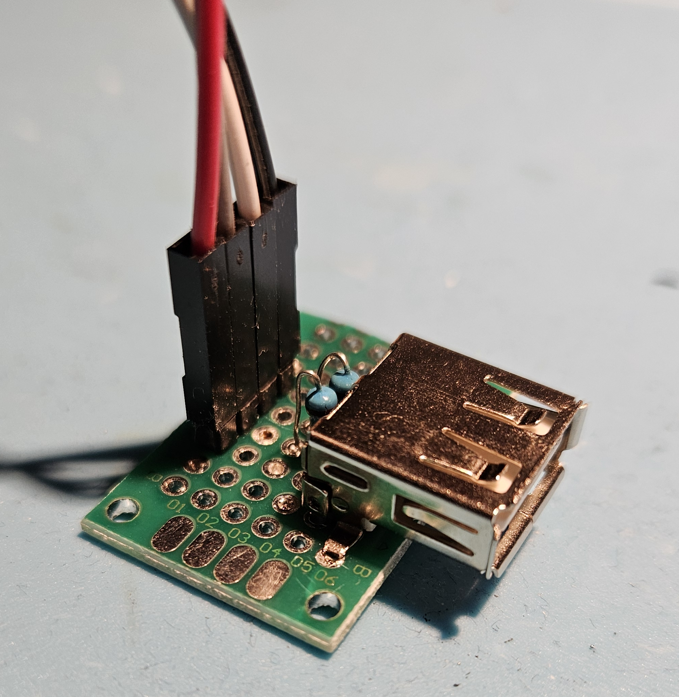
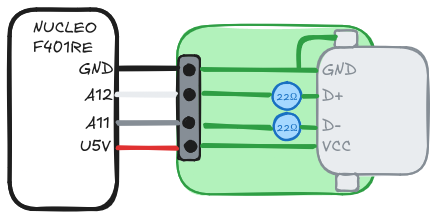

# nucleof401re_tinyusb

Examples for implementation of TinyUSB into NUCLEO F401RE

(WORK-IN-PROGRESS)

## DIY USB Module

The pinouts of a USB-A Female connector is:

Put it on a through-hole PCB like this:

The wiring for the **DIY USB Module** to a **Nucleo F401RE**-devboard is shown here:

